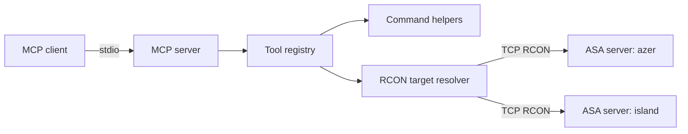

# Architecture

`ark-asa-mcp` is a stdio-based MCP server that bridges MCP tool calls to one or more Ark: Survival Ascended RCON targets.

## Goals

- Provide a small, understandable Node.js MCP server.
- Keep ASA RCON credentials outside the repository.
- Make common server operations available as dedicated MCP tools.
- Route tool calls to named ASA servers with `serverName`.
- Preserve access to raw RCON for advanced operators.
- Keep command formatting and parsing testable without a live ASA server.

## Non-Goals

- Hosting an HTTP API.
- Persisting server state.
- Replacing ASA server management panels.
- Running integration tests against a real ASA instance by default.

## High-Level Flow



## Runtime Components

| Component | File | Responsibility |
| --- | --- | --- |
| Bootstrap | `src/index.ts` | Load config, create the MCP server, connect stdio transport. |
| Configuration | `src/config.ts` | Read and validate named RCON server definitions. |
| Tools | `src/tools.ts` | Register MCP tools, including optional `serverName` inputs, and format tool results. |
| Commands | `src/commands.ts` | Validate raw commands, build known ASA commands, parse known output. |
| RCON | `src/rcon.ts` | Resolve the selected server, connect to ASA RCON, send one command, truncate oversized responses. |

## Configuration

Configuration is loaded at startup. The preferred format is a local `config.json` file with named RCON targets.

| Field | Default | Notes |
| --- | --- | --- |
| `defaultServerName` | none | Optional default `serverName` when tools omit it. |
| `timeoutMs` | `10000` | Connection and command timeout. |
| `maxResponseChars` | `20000` | Safety cap for tool responses. |
| `servers` | none | Non-empty array of named RCON server definitions. |

Each `servers` entry supports `serverName`, `host`, `port`, `password`, `timeoutMs`, and `maxResponseChars`.

```json
{
  "defaultServerName": "azer",
  "servers": [
    {
      "serverName": "azer",
      "host": "127.0.0.1",
      "port": 27020,
      "password": "change-me"
    }
  ]
}
```

By default, the server reads `config.json` from the process working directory. `ARK_ASA_CONFIG_PATH` can point at an explicit config file.

The legacy single-server variables still work when no config file exists: `ARK_ASA_RCON_SERVER_NAME`, `ARK_ASA_RCON_HOST`, `ARK_ASA_RCON_PORT`, and `ARK_ASA_RCON_PASSWORD`.

`ARK_ASA_RCON_SERVERS` and the shorter `ARK_RCON_*` aliases are also accepted as environment fallbacks.

## Server Selection

Server-bound tools accept an optional `serverName` argument. Resolution follows this order:

1. Use the provided `serverName`.
2. Use `defaultServerName` from config when configured.
3. Use the only configured server when exactly one exists.
4. Return a tool error listing available server names.

## RCON Connection Model

Each tool invocation resolves the target server, opens a short-lived RCON connection, sends one command, returns the response, and closes the connection. This keeps the implementation predictable and avoids stale long-lived sockets when an ASA server restarts.

If a future use case needs high-frequency polling, a pooled connection manager can replace the current short-lived model behind the same `AsaRconClient` interface.

## Error Handling

Tool handlers return MCP error results instead of exposing stack traces. Configuration errors are raised during startup, while connection or command errors are returned to the invoking MCP client.

## Security Boundaries

The MCP server has the same effective authority as the configured RCON accounts. The raw command tool accepts arbitrary single-line commands, so it should only be connected to trusted MCP clients.

Newline characters are rejected before commands reach RCON. This prevents accidental multi-command batching through a single tool call.

## Extension Points

Future work can add dedicated wrappers for common ASA operations:

- Kick, ban, and unban player tools.
- Tribe or structure inspection commands.
- Server message-of-the-day updates.
- Optional command allowlists for restricted deployments.
- Integration tests against a disposable RCON test server.
