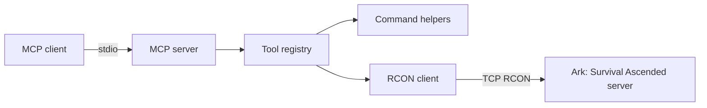

# Architecture

`ark-asa-mcp` is a stdio-based MCP server that bridges MCP tool calls to Ark: Survival Ascended RCON commands.

## Goals

- Provide a small, understandable Node.js MCP server.
- Keep ASA RCON credentials outside the repository.
- Make common server operations available as dedicated MCP tools.
- Preserve access to raw RCON for advanced operators.
- Keep command formatting and parsing testable without a live ASA server.

## Non-Goals

- Hosting an HTTP API.
- Persisting server state.
- Replacing ASA server management panels.
- Running integration tests against a real ASA instance by default.

## High-Level Flow

## Runtime Components

| Component | File | Responsibility |
| --- | --- | --- |
| Bootstrap | `src/index.ts` | Load config, create the MCP server, connect stdio transport. |
| Configuration | `src/config.ts` | Read and validate environment variables. |
| Tools | `src/tools.ts` | Register MCP tools and format tool results. |
| Commands | `src/commands.ts` | Validate raw commands, build known ASA commands, parse known output. |
| RCON | `src/rcon.ts` | Connect to ASA RCON, send one command, truncate oversized responses. |

## Configuration

Configuration is loaded at startup. The server requires an RCON password and falls back to common ASA defaults for host and port.

| Variable | Default | Notes |
| --- | --- | --- |
| `ARK_ASA_RCON_HOST` | `127.0.0.1` | ASA RCON host. |
| `ARK_ASA_RCON_PORT` | `27020` | ASA RCON port. |
| `ARK_ASA_RCON_PASSWORD` | none | Required. |
| `ARK_ASA_RCON_TIMEOUT_MS` | `10000` | Connection and command timeout. |
| `ARK_ASA_RCON_MAX_RESPONSE_CHARS` | `20000` | Safety cap for tool responses. |

The shorter `ARK_RCON_*` aliases are also accepted.

## RCON Connection Model

Each tool invocation opens a short-lived RCON connection, sends one command, returns the response, and closes the connection. This keeps the implementation predictable and avoids stale long-lived sockets when an ASA server restarts.

If a future use case needs high-frequency polling, a pooled connection manager can replace the current short-lived model behind the same `AsaRconClient` interface.

## Error Handling

Tool handlers return MCP error results instead of exposing stack traces. Configuration errors are raised during startup, while connection or command errors are returned to the invoking MCP client.

## Security Boundaries

The MCP server has the same effective authority as the configured RCON account. The raw command tool accepts arbitrary single-line commands, so it should only be connected to trusted MCP clients.

Newline characters are rejected before commands reach RCON. This prevents accidental multi-command batching through a single tool call.

## Extension Points

Future work can add dedicated wrappers for common ASA operations:

- Kick, ban, and unban player tools.
- Tribe or structure inspection commands.
- Server message-of-the-day updates.
- Optional command allowlists for restricted deployments.
- Integration tests against a disposable RCON test server.
